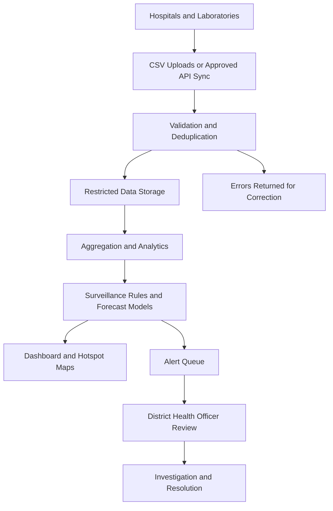

# 🏥 Hospital-Connected Disease Surveillance and Early-Warning Platform

## 🎯 Overview

The **Hospital-Connected Disease Surveillance and Early-Warning Platform** is a proposed AI-powered public health system designed to connect **hospitals, diagnostic laboratories, and district health departments**.

Hospitals will **upload patient and laboratory records or automatically synchronize data** through approved integrations. The platform will use **Machine Learning (ML), geographic analysis, and surveillance rules** to monitor **malaria and typhoid**, forecast case trends, identify potential hotspots, and generate alerts for **district health officers**.

The platform aims to help health teams identify unusual increases in reported cases, investigate affected areas, and prioritize response resources.

> **Project status:** Research and planning stage. The features below describe the intended product; a runnable application and validated prediction models are not yet available in this workspace.

⚠️ **Disclaimer:** This project is currently for **educational, research, and prototyping purposes**. Predictions and alerts require evaluation and authorized professional review before operational use. The platform does not provide prescriptions or replace clinical diagnosis or laboratory confirmation.

**Disease scope:** Malaria is primarily mosquito-borne, so the platform uses the broader term **disease surveillance** rather than describing both diseases as waterborne. [WHO malaria fact sheet](https://www.who.int/news-room/fact-sheets/detail/malaria).

---

## 🎯 Objectives

- Enable **hospital and laboratory data uploads and automated synchronization**.
- Monitor **suspected and confirmed malaria and typhoid cases** separately.
- Develop **area-level disease risk estimates and case forecasts**.
- Identify **geographic hotspots and unusual increases in reported cases**.
- Generate **early-warning alerts for district health officers**.
- Provide **interactive dashboards and aggregate surveillance reports**.
- Support a **mobile-friendly web interface and approved API integrations**.
- Build a **scalable, modular platform with controlled data access**.

---

## ✅ Quick Start Checklist with Links

- Review the [Research Foundation](#-research-foundation).
- Explore the [System Architecture](#-system-architecture).
- View the [Dashboard Reference](#-dashboard-reference).
- Define the [Data Requirements](#-data-requirements) with participating hospitals.
- Follow the [Development Plan](#-development-plan).
- Agree on case definitions, reporting frequency, alert ownership, and authorized data use.
- Prepare synthetic data for the initial prototype.

**Setup status:** Installation commands will be added when application code and dependencies are available. This workspace currently contains documentation, the reference paper, and the dashboard image.

## 🏗️ System Architecture

### 1. Hospital and Laboratory Data Integration

- Upload standardized **CSV files** containing approved patient and test data.
- Synchronize records through **hospital and laboratory APIs** where available.
- Map facility-specific fields to a shared reporting schema.
- Validate dates, disease codes, locations, and test results.
- Detect duplicate submissions and preserve corrected-record history.
- Track import errors, reporting completeness, and synchronization status.

### 2. AI and Early-Warning Engine

- Aggregate case records by disease, geographic area, and reporting period.
- Compare current observations with historical and seasonal baselines.
- Evaluate candidate models for **future case counts and area-level risk**.
- Display forecast horizons and uncertainty intervals.
- Generate alerts when approved surveillance thresholds are exceeded.
- Record model versions, triggering rules, and supporting evidence.

### 3. Surveillance Dashboard

- Provide disease filters for **malaria and typhoid**.
- Display case summaries, time trends, geographic patterns, and active alerts.
- Show reporting coverage and the latest data refresh time.
- Offer separate views for hospital staff and district health officers.
- Support acknowledgment, investigation notes, assignment, and alert closure.

### 4. Data and Analytics Layer

- Store validated records with source and import history.
- Maintain aggregate surveillance datasets and geographic boundaries.
- Store forecasts, alert history, and audit records.
- Apply role-based access and organization boundaries.
- Support authorized aggregate reporting and reproducible model evaluation.



## 📌 Key Features

### 💡 AI-Powered Disease Forecasting

- Estimate malaria and typhoid trends for a defined future reporting period.
- Compare forecasts with simple historical and seasonal baselines.
- Show uncertainty and indicate when data are insufficient.
- Keep **observed cases, model estimates, and rule-based signals** clearly distinguishable.

### 🏥 Hospital-Connected Reporting

- Standardized uploads with validation summaries.
- Planned automatic synchronization of new and updated records.
- Facility reporting status and missing-submission indicators.
- Traceable corrections and safe retries that avoid duplicate imports.

### 🗺️ Geographic Hotspot Identification

- Map reported cases by approved district or locality boundaries.
- Highlight unusual increases that warrant investigation.
- Show population-adjusted rates only when suitable denominators exist.
- Distinguish patient residence from hospital location.
- Account for missing reports and changes in facility participation.

### 🚨 Early-Warning Alerts

- Configurable disease- and district-specific thresholds.
- In-app alert queue with severity, evidence, and ownership.
- Acknowledgment, escalation, and investigation tracking.
- Planned email/SMS delivery with minimal sensitive information.
- Deduplication and cooldown rules to reduce repeated notifications.

### 📊 Data-Driven Insights

- Trends in suspected cases, confirmed cases, and tests performed.
- Positivity rates where appropriate testing denominators are available.
- Aggregated age-band and sex distributions with unknown values identified.
- Reporting completeness, data freshness, and validation error summaries.
- Downloadable reports for authorized users.

### 🌐 Multi-Platform Support

- Web dashboard for hospitals and health departments.
- Responsive interface for desktop, tablet, and mobile browsers.
- Approved API integrations with participating health systems.
- Role-specific access to facility and district information.

### ⚙️ Scalable and Modular

- Extend the platform to additional diseases and reporting facilities.
- Add hospital connectors without changing core surveillance workflows.
- Version datasets, case definitions, model outputs, and alert rules.
- Support approved hosted or on-premises deployments.

---

## 🖼️ Dashboard Reference

![https://github.com/dr-mushtaq/Water-borne-diseases/blob/main/Images/Overview.JPG]

*User-supplied research dashboard reference. The displayed figures are reference content, not current surveillance data or results from an implemented application in this repository.*

### Proposed Dashboard Layout

| Panel | Planned Content |
| --- | --- |
| **Navigation** | Overview, Malaria, Typhoid, Hospitals & Labs, Uploads & Sync, Hotspots, Alerts, Reports |
| **Filters** | Disease, district, facility, date range, and case status |
| **Summary Cards** | Confirmed cases, suspected cases, tests performed, active alerts, reporting completeness |
| **Hotspot Map** | Geographic case distribution with reporting coverage and a separate forecast-risk layer |
| **Trend Charts** | Historical observations, future forecasts, and uncertainty intervals |
| **Hospital Reporting** | Expected submissions, latest successful sync, and validation errors |
| **Alert Management** | Trigger, severity, responsible officer, acknowledgment, and investigation status |

Filters should apply consistently across panels and exports. Missing reports must be distinguished from zero cases, and charts should have accessible table alternatives.

The patient prediction form in the reference is outside the initial operational MVP. A negative model estimate must never be displayed as proof that a patient is healthy.

---

## 🧪 Example Interaction

**Hospital Input — fictional demonstration:**

A reporting officer uploads a weekly laboratory file containing typhoid test results for patients residing in Demonstration District, Area A.

**System Processing:**

- Validate and deduplicate records.
- Summarize cases for the selected reporting period.
- Compare the aggregate with the configured surveillance threshold.
- Show reporting coverage and create an alert for officer review.

**Illustrative System Output:**

```text
Disease: Typhoid
Area: Demonstration District, Area A
Reporting Period: Most recent complete week
Reported Confirmed Cases: 24
Illustrative Reference Level: 10 cases per week
Reporting Coverage: 4 of 5 expected facilities
Alert: Configured surveillance threshold exceeded
Status: Awaiting district health officer review
Follow-up: Review data quality and investigate the increase
```

These values are fictional and do not define a validated outbreak threshold. The alert requests investigation; it does not independently confirm an outbreak.

## 🧰 Technology Stack

**Proposed design candidates — not installed dependencies or finalized technology selections.**

| Component | Candidate Tools |
| --- | --- |
| **ML and Statistical Models** | scikit-learn, XGBoost, statsmodels |
| **Data Processing** | Python, pandas, NumPy |
| **Backend** | FastAPI |
| **Frontend** | React with TypeScript; Streamlit may support an initial analytical prototype |
| **Maps and Spatial Data** | Leaflet, PostgreSQL with PostGIS |
| **Database** | PostgreSQL |
| **Background Processing** | Celery and Redis, if required by integration workloads |
| **Model and Data Versioning** | MLflow and DVC |
| **Integration** | CSV and approved APIs; HL7/FHIR adapters where supported and tested |
| **Deployment** | Docker in an approved hosted or on-premises environment |

### Candidate Models for Surveillance and Forecasting

| Approach | Input Data | Intended Use | Evaluation Considerations |
| --- | --- | --- | --- |
| **Historical or Seasonal Baseline** | Past case counts by area and reporting period | Establish a reference forecast | Required comparison for more complex models |
| **Statistical Time-Series Models** | Regularly aggregated disease counts | Estimate future case trends | Assess seasonality, reporting gaps, and forecast uncertainty |
| **Random Forest / Gradient Boosting** | Lagged counts, calendar features, and approved contextual variables | Explore nonlinear forecasting relationships | Use time-based evaluation and prevent future-data leakage |
| **Surveillance Threshold Rules** | Current observations and a defined reference level | Flag increases for investigation | Evaluate false alerts, missed events, and reporting coverage |

Medical language models are not required for the initial structured-data workflow. Extraction from free-text clinical notes may be investigated later if a defined use case, authorized data access, and a validation process justify it.

---

## 🗃️ Data Requirements

| Data Group | Example Fields | Purpose |
| --- | --- | --- |
| **Source Identity** | facility_id, source_record_id, record_updated_at | Trace records, deduplicate, and process corrections |
| **Authorized Linkage** | facility-scoped pseudonymous_patient_id, encounter_id | Link encounters and tests within the approved scope |
| **Dates** | encounter_date, specimen_date, result_date, received_at | Separate event timing from reporting delays |
| **Geography** | district_code, locality_code, facility_code | Support appropriate geographic aggregation |
| **Disease Classification** | disease_code, case_status, case_definition_version | Separate suspected and confirmed cases |
| **Laboratory Results** | test_type, result, result_status | Track test outcomes and subsequent updates |
| **Optional Demographics** | age_band, sex | Support justified aggregate subgroup analysis |
| **Provenance** | import_batch_id, source_system, schema_version | Maintain a reproducible audit trail |

Collect only data justified by the agreed surveillance purpose. Define repeat-test and disease-episode counting rules before producing totals. Facility-scoped identifiers do not establish identity across hospitals; cross-facility linkage requires a separately agreed method.

---

## 🚀 Development Plan

### Phase 1: Prototype

- Confirm pilot hospitals, districts, case definitions, and reporting workflows.
- Create a synthetic dataset and standardized CSV schema.
- Build validated uploads, disease summary cards, trend charts, and a geographic view.
- Implement configurable threshold alerts with officer acknowledgment.

### Phase 2: 🧪 Evaluation

- Validate imports, correction handling, deduplication, and aggregate totals.
- Evaluate forecasts using **MAE, RMSE, and prediction interval coverage**.
- Measure alert **precision, recall, false-alert frequency, and detection lead time** against reviewed events.
- Use held-out future periods and assess performance in withheld facilities or districts.
- Evaluate malaria and typhoid separately and compare models with seasonal baselines.
- Exclude information unavailable at prediction time and monitor reporting delays.

**No platform benchmark results are available yet.** Accuracy figures from the previous medicine recommendation project are not applicable.

### Phase 3: Enhancement

- Add historical forecasts and uncertainty displays after evaluation.
- Improve geographic analysis and reporting-completeness indicators.
- Add investigation notes, escalation, and aggregate report exports.
- Refine usability with hospital staff and district health officers.

### Phase 4: Connected Pilot and Deployment

- Integrate one approved hospital or laboratory system.
- Reconcile synchronized data with source records.
- Test notification delivery, monitoring, backups, and restoration.
- Evaluate alert usefulness and response times during a supervised pilot.
- Expand participating facilities after reviewing pilot findings.

### Phase 5: Database and Data Layer

*Begin foundational storage work during Phase 1; this phase expands and hardens it.*

- Maintain persistent storage for validated records, imports, aggregates, forecasts, and alerts.
- Implement role-based access, organization boundaries, encryption, and audit logs.
- Establish retention rules, correction workflows, and data versioning.
- Monitor missing data, schema changes, and model/data drift.
- Mark forecasts unavailable when required data are insufficient.

### Phase 6: Governance and Commercial Readiness

*Start governance planning before any live patient-data pilot.*

- Establish data-sharing authority, permitted uses, hosting arrangements, and access responsibilities.
- Review applicable local requirements with partner organizations; avoid assuming a particular regulatory classification or approval route.
- Document intended use, model limitations, evaluation results, and human review responsibilities.
- Apply aggregation and small-count suppression where needed to reduce disclosure risk.
- Define operational support, incident handling, and response ownership.
- Agree on readiness criteria before operational rollout.

This README does not certify regulatory approval or compliance with any legal framework.

## 💼 Commercial Extension

The proposed platform would serve **district health departments, hospital networks, diagnostic laboratory networks, and public health programs**.

Potential offerings include:

- Platform subscriptions for disease dashboards and alert management.
- Hospital integration, configuration, and onboarding services.
- Approved hosted or on-premises deployment options.
- Training, maintenance, and operational support.

Pricing remains to be defined with pilot partners. Early value should be measured through reporting timeliness, data quality, facility coverage, useful alerts, and time to acknowledgment and investigation. Claims about improved health outcomes require separate evaluation.

## 🔮 Future Scope

- Additional hospital and laboratory integrations.
- Additional diseases with approved case definitions and evaluation datasets.
- Weather and environmental inputs where quality and relevance are established.
- Multilingual dashboards and reporting workflows.
- Offline-assisted reporting for facilities with unreliable connectivity.
- Cross-district trend analysis and resource-planning views.
- Optional, separately validated research on patient-level risk prediction.

---

## 📚 Research Foundation

The project is inspired by [Machine learning based efficient prediction of positive cases of waterborne diseases](https://doi.org/10.1186/s12911-022-02092-1), published in *BMC Medical Informatics and Decision Making* in 2023.

The study analyzed malaria and typhoid patient records from Ayub Medical Hospital for 2017–2020 and proposed a warning/dashboard system to help health departments identify affected areas and predict positive cases.

Hospital synchronization, district forecasting, and operational alert management are proposed product extensions. The paper's patient-level classification results do not establish future outbreak forecasting performance.

📄 [Local research paper](s12911-022-02092-1.pdf)

## 📬 Contact

- **Email:** mushtaqmsit@gmail.com
- **LinkedIn:** [Mushtaq Hussain](https://www.linkedin.com/in/mushtaq-hussain-21417814/)
- **YouTube:** [Coursesteach](https://www.youtube.com/@coursesteach-mv5si)
- **Team ID:** themushtaq48

## 🤝 Contributing

Contributions in hospital integration, epidemiology, forecasting, mapping, dashboard design, and documentation are welcome. Discuss major changes before implementation, use synthetic or authorized de-identified data, and document assumptions and validation results. Keep patient records, private datasets, and credentials out of source control.

## License

The original README proposed the MIT License, but no LICENSE file is currently present. Confirm the license and add its text before distributing code. Research publications, datasets, and third-party dependencies retain their respective terms.


# Water-borne-diseases
**Related data**
1. [Interpreting Tree-Based Model's Prediction of Individual Sample](https://coderzcolumn.com/tutorials/machine-learning/treeinterpreter-interpreting-tree-based-models-prediction-of-individual-sample?fbclid=IwAR2-zcjOO-c3XfiDoG6eufSmBaFz9mnrislreMJF6NluNUAwZZWCWtM8kYI)
2. [Malaria Detection using Deep Learning | Python Final Year IEEE Project 2020 - 2021](https://www.youtube.com/watch?v=PHK9RrYfEQ4&ab_channel=JPINFOTECHPROJECTS)
3. [Build a system to identify fake news articles!](https://medium.com/nerd-for-tech/build-a-system-to-identify-fake-news-articles-6604968043cb)
4. [END TO END Machine learning Project deployment on Flask server.](https://www.youtube.com/watch?v=PH0M8ktKCRo)
5. [Live- Implementation of End To End Kaggle Machine Learning Project With Deployment](https://www.youtube.com/watch?v=p_tpQSY1aTs&ab_channel=KrishNaik)
6. [Car-Price-Prediction](https://github.com/krishnaik06/Car-Price-Prediction/blob/master/Untitled.ipynb)
7. [venugopalkadamba Multi_Disease_Predictor](https://github.com/venugopalkadamba/Multi_Disease_Predictor)
8. [End to End Deployment of Breast Cancer Prediction Through Machine Learning using Flask](https://medium.com/analytics-vidhya/end-to-end-deployment-of-breast-cancer-prediction-through-machine-learning-using-flask-a40abbabf1fe)
9. [Build a Machine Learning web application from scratch in Python with Streamlit.](https://morioh.com/p/28f32a0d90a2?f=5c21fb01c16e2556b555ab32&fbclid=IwAR2IEef_M-c4je1UrV1XE0EX-S6NX6j1ib2b6yHAc7LPMfAxuurdzaAxxdY)
10. [ditikrushnaEnd-to-End-Diabetes-Prediction-Application-Using-Machine-Learning](https://github.com/ditikrushna/End-to-End-Diabetes-Prediction-Application-Using-Machine-Learning)
11. [Disease-Prediction-from-Symptoms](https://github.com/anujdutt9/Disease-Prediction-from-Symptoms)
